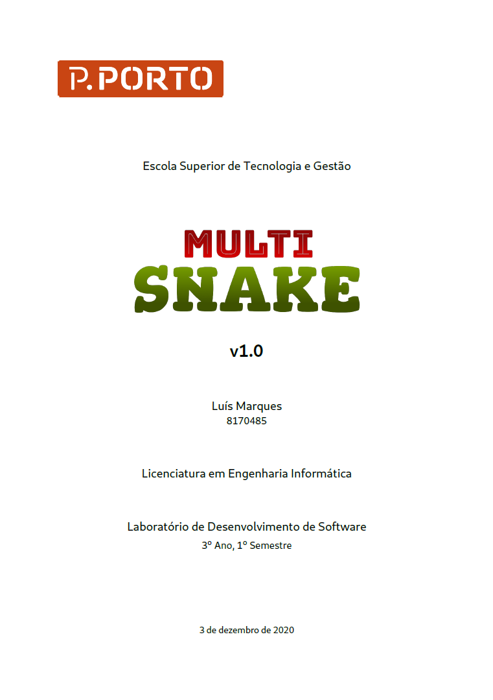

# Documents

>This section is exclusively for documents. To view the full document click the images below.

## Report

<kbd></kbd>

## SCM Plan

<kbd></kbd>

## Requirements

<kbd></kbd>

## User Stories

<kbd></kbd>

## Mockups

Go to [`Mockups`](Mockups).

## UML Diagrams

Go to [`UML_Diagrams`](UML_Diagrams).
