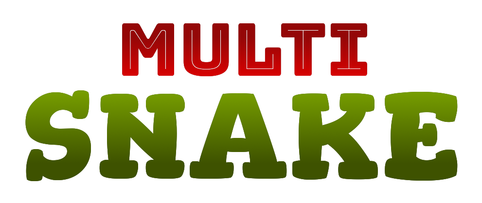

# 

## Contents

- [Purpose](#purpose)
- [Built with](#built-with)
  - [Documentation](#documentation)
  - [Version Control](#version-control)
  - [Web App](#web-app)
  - [REST API](#rest-api)
- [License](#license)
- [Author](#author)

## Purpose

Project carried for the 2020 oral exam within the scope of **_Laboratório de Desenvolvimento de Software_** from **Licenciate Degree in Computer Engineering** at **_Escola Superior de Tecnologia e Gestão - P.Porto_**. The main focus is to develop software using the Scrum methodology.

## Documents

See all the documents in [`Docs`](Docs).

## Web App

Our web application was made with Angular. See [`App`](App) for more information.

## Web API

The web API was made using .NET. See [`Server`](Server) for more information.

## Built with

### Documentation

- [MS Office Word](https://www.microsoft.com/pt-pt/microsoft-365/word) - Minutes and individual reports
- [LaTeX](https://www.latex-project.org/) - Reports

### Version Control

- [GitLab](https://gitlab.com/) - Version control

### Web App

- [MS Visual Studio Code](https://code.visualstudio.com/) - Source code editor
- [Angular](https://angular.io/) - Framework

### REST API

- [JetBrains Rider](https://www.jetbrains.com/rider/) - IDE
- [ASP.NET Core](https://dotnet.microsoft.com/apps/aspnet) - Framework

## License

Distributed under the [MIT License](https://choosealicense.com/licenses/mit/). See [`LICENSE`](LICENSE) for more information.

## Author

- **Luis Marques** - 8170485 - [LuisMarques99](https://github.com/LuisMarques99)